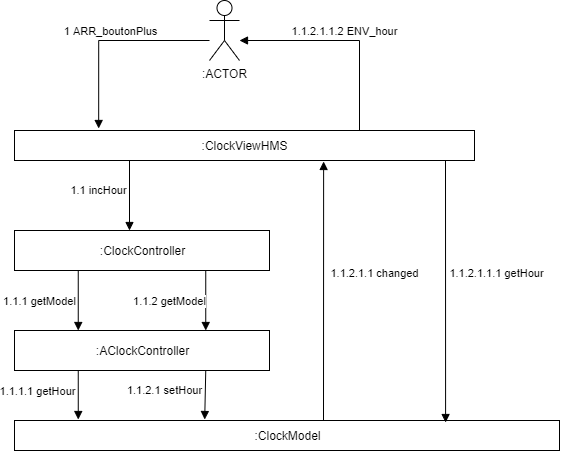

# MVC Horloge

3-
__Horloge1 :__  

- cc1 ne gère aucune mise à jour : controleur vide
- cc2 gère seulement les mises à jours des heures
- cc3 gère les mises à jours des minutes et des heures avec le principe de décorateur

__Horloge 2:__  

- cc4 ne gère aucune mise à jour.
- cc5 gère les mises à jours des minutes.
- cc6 gère les mises à jours des minutes et des heures.

4- Un objet de la classe ClockController gère la mise à jour des heures, des minutes et des secondes. 

Q6- Diagramme de communication :

